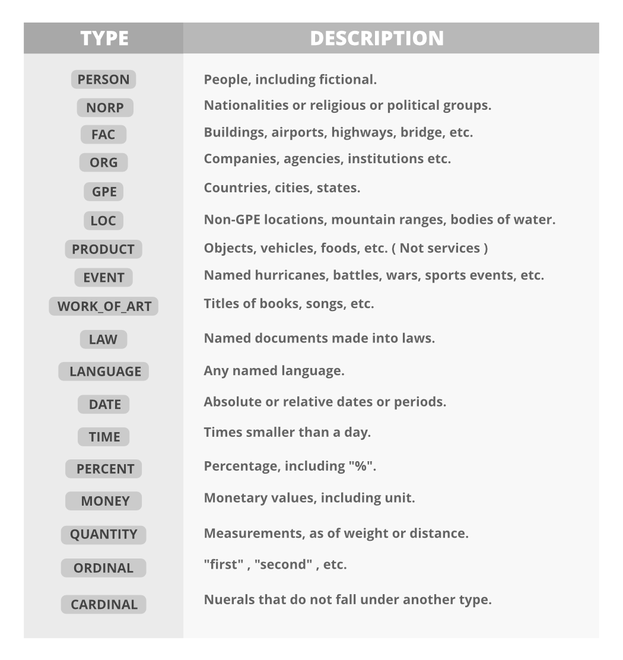
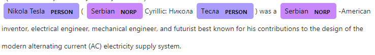

# Entity-Linking


## Named Entity Recognition (NER)
It is the process of identifying the key information in the text.
Each piece of information is classified into a set of predefined categories such as people, organizations, and locations.
An entity is the thing that is consistently talked about or referred to in the particular text.

### Three main steps
NER consists of three main steps: 
1. Tokenization, which involves breaking the text into individual words or phrases.
2. Part-of-speech tagging, which assigns a grammatical tag to each word.
3. Entity recognition, which identifies and classifies the named entities in the text.

### Model
In this project Deep Learning Based NER is used.
It uses machine learning algorithms to analyze text and identify patterns that indicate the presence of named entities.
These algorithms are trained on large datasets of annotated text, where human annotators have labeled the named entities in the text.
SpaCy NER uses a method called word embedding, that is capable of understanding the semantic and syntactic relationship between various words

SpaCy allows using their [Trained Models & Pipelines](https://spacy.io/models).
Currently, in this project the model [en_core_web_lg](https://spacy.io/models/en#en_core_web_lg) is used.
It can be downloaded using the following command:
```bash
python -m spacy download en_core_web_lg
```
After that the package is loaded in the Python file via
```python 
spacy.load('en_core_web_sm')
```

### Entity tags
Below is a list and the meaning of SpaCy entity tags, which are used during the process of classification of the entities:



### Output
For each entity the systems returns:
- the surface form (text) of the entity
- the number of the starting character
- the number of the ending character
- the label, which is the name of one of the predefined classes

For example for the text:
```text
Nikola Tesla (Serbian Cyrillic: Никола Тесла) was a Serbian-American inventor, electrical engineer, mechanical engineer, and futurist best known for his contributions to the design of the modern alternating current (AC) electricity supply system.
```

The entities would be:
```text
[('Serbian', 14, 21, 'NORP'),
('Никола Тесла', 32, 44, 'FAC'),
('Serbian', 52, 59, 'NORP'),
('AC', 216, 218, 'ORG')]
```

The labelled text looks like this:


